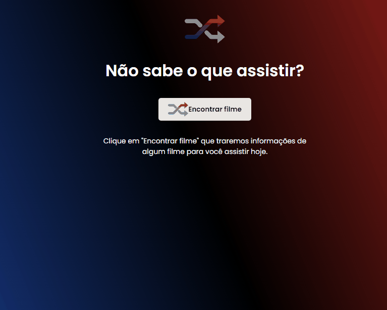

<p align="center">
  <a href="https://unform.dev">
    
  </a>
</p>
<h1 align="center">Rocketflix</h1>
<p align="center">🚀 Desafio proposto pela Rocketseat  do curso Discover, de um gerador de filme randômico </p>
<div align="center">
  
  
  
</div>
<p align="center">
 <a href="#objetivo">Objetivo</a> •
 <a href="#tecnologias">Tecnologias</a> • 
 <a href="#contribuicao">Pré-requisitos</a> • 
 <a href="#licenc-a">Licença</a> • 
 <a href="#autor">Autor</a>
</p>
<h4 align="center"> 
	🚧  Rocketflix 🚀 Concluído.  🚧
</h4>

### Features

- [x] Ao clicar no botão, fazer uma requisição na api
- [x] Caso a requisição falhe, mostrar tela de not found personalizada
- [ ] Responsividade

<div align="center">
  
  
</div>


### Pré-requisitos

Antes de começar, você vai precisar ter instalado em sua máquina as seguintes ferramentas:
[Git](https://git-scm.com).
Além disto é bom ter um editor para trabalhar com o código como [VSCode](https://code.visualstudio.com/)


### 🎲 Rodando o pojeto na sua máquina

```bash
# Clone este repositório
$ git clone <https://github.com/davivsouza/rocket-flix>

# Acesse a pasta do projeto no terminal/cmd
$ cd rocket-flix

# Instale as dependências
$ npm install

# Execute a aplicação em modo de desenvolvimento
$ npm run dev

# O servidor inciará na porta:3000 - acesse <http://localhost:3000>
```
Obs: Esse projeto foi feito com uso de uma api que necessita de uma key. 
Faça seu registro e pegue a key neste [link](https://www.themoviedb.org/documentation/api)

link de exemplo para fazer requisição: "https://api.themoviedb.org/3/movie/550?api_key=sua-api-key"


<h1 id="tecnologias">🛠 Tecnologias</h1>

As seguintes ferramentas foram usadas na construção do projeto:


- [React](https://pt-br.reactjs.org/)
- [TypeScript](https://www.typescriptlang.org/)
- [Styled-components](https://styled-components.com/docs)
- [Axios](https://github.com/axios/axios)

### Autor
---

<a href="https://blog.rocketseat.com.br/author/thiago/">
 
 <br />
 <sub><b>Thiago Marinho</b></sub></a> <a href="https://blog.rocketseat.com.br/author/thiago//" title="Rocketseat">🚀</a>


Feito com ❤️ por Davi V. Souza 👋🏽 Entre em contato!

[](https://www.linkedin.com/in/davi-vasconcelos-souza-236170234/) 
[](mailto:davivasconcelossouza21@gmail.com)
